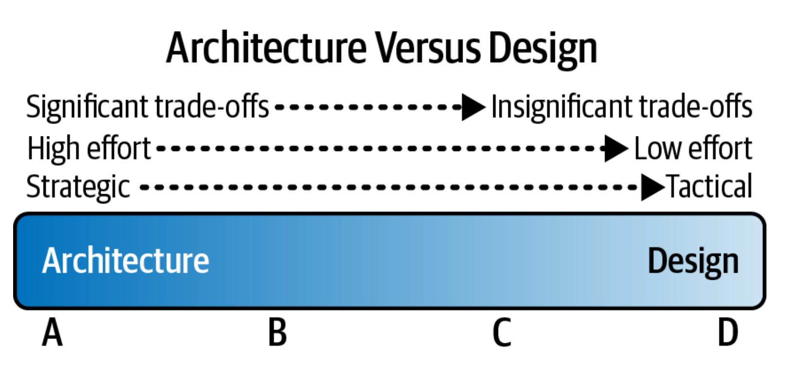

## Software Archicture

### archicture vs design

---

The more strategic a decision, the more architectural it
becomes. Conversely, the more tactical a decision, the more it’s
likely to be about design. Strategic decisions are generally long-
term, whereas tactical decisions are generally short-term and
usually independent of other actions or decisions.

---
# I Foundations
To understand important trade-offs in architecture, developers
must understand some basic concepts and terminology
concerning components, modularity, coupling, and
connascence.

# II Architecture Styles
Understanding architecture styles occupies much of new
architects’ time and effort, because styles are important and
abundant. Architects must understand the various styles and
the trade-offs encapsulated within each to make effective
decisions; each architecture style embodies a well-known set of
trade-offs that help architects make the right choice for a
particular business problem.

# III Techniques and Soft Skills
An effective software architect must not only understand the
technical aspects of software architecture, but also the primary
techniques and soft skills necessary to think like an architect,
guide development teams, and effectively communicate the
architecture to various stakeholders.